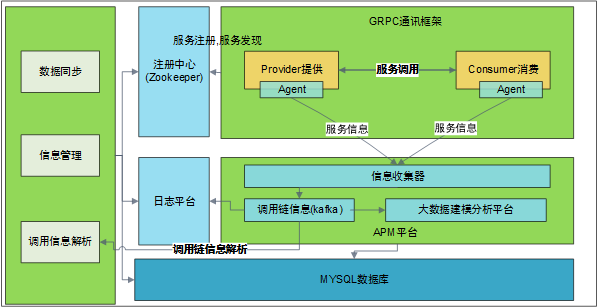

# 东方证券微服务治理平台

微服务治理平台系统架构如下：

微服务治理平台具有以下特征：

1. 支持多语言多协议的RPC框架。RPC是服务治理的核心，构建一个面向多种语言、多种协议的RPC框架满足服务发布与调用的基本需求；
2. 服务元数据信息管理。服务信息的发布、检索（查询）、更新、删除是面向服务架构的基本需求，构建以服务元数据为核心的服务注册信息中心；
3. 服务调用负载均衡功能。对于多实例的服务的调用，提供对多个服务实例的负载均衡调度，实现负载按照预定的调度算法进行调度执行；
4. 服务流量控制。通过设置请求数或连接数上限，动态实现对各服务接口的流控管理；
5. 服务访问控制与黑白名单机制。提供多种形式的服务访问控制策略，能够根据设定的安全策略对调用者进行安全检查，支持黑白名单等安全机制；
6. 服务健康检测。服务与注册中心Zookeeper之间保持长链接，具有心跳检测机制,能够周期性的检查服务的状态，确保服务可用性状态一致性，可处理服务进程意外终止、服务器宕机等场景；
7. 服务跟踪与信息采集功能。采集调用端和服务端的信息，包括调用时间、调用关系、服务时间、故障日志、状态信息、可用性等信息；提供对于上述信息的进一步分析，包括性能统计、阈值告警、聚类相关性等。
8. 服务调用关系与拓扑可视化。根据信息采集结果对服务的扇入和扇出信息进行分析，对调用链进行分析并可视化呈现；提供基于调用链的故障快速定位等功能。

